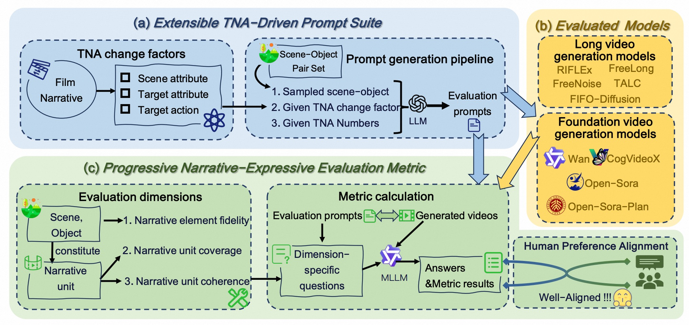
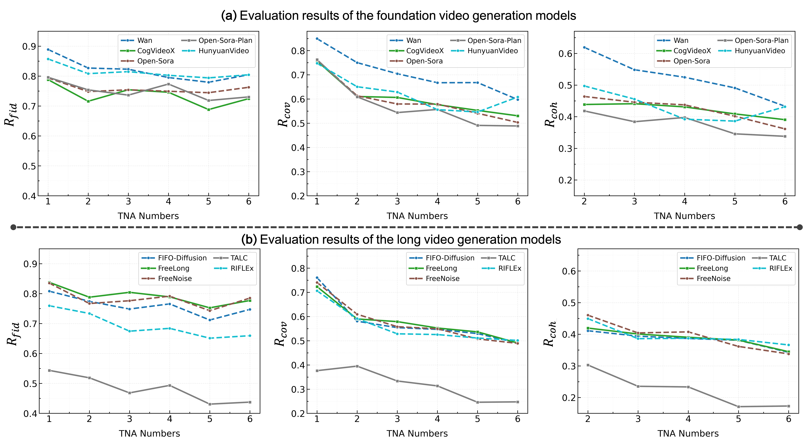

# **NarrLV:** Towards a Comprehensive Narrative-Centric Evaluation for Long Video Generation Models

[](https://amap-ml.github.io/NarrLV-Website/)
[](https://huggingface.co/datasets/Xiaokunfeng2022/NarrLV/tree/main)


# 🔥 Updates

*   \[5/2024\] **NarrLV** evaluation code & prompt set are available!
    

# 📣 Overview

<p align="center">
  
</p>


With the rapid development of foundation video generation technologies, long video generation models have exhibited promising research potential thanks to expanded content creation space. Recent studies reveal that the goal of long video generation tasks is not only to extend video duration but also to accurately express richer narrative content within longer videos. 
However, due to the lack of evaluation benchmarks specifically designed for long video generation models, the current assessment of these models primarily relies on benchmarks with simple narrative prompts (e.g., VBench).
To the best of our knowledge, our proposed **NarrLV** is the first benchmark to comprehensively evaluate the **Narr**ative expression capabilities of **L**ong **V**ideo generation models.
Inspired by film narrative theory, **(i)** we first introduce the basic narrative unit maintaining continuous visual presentation in videos as Temporal Narrative Atom (TNA), and use its count to quantitatively measure narrative richness. Guided by three key film narrative elements influencing TNA changes, we construct an automatic prompt generation pipeline capable of producing evaluation prompts with a flexibly expandable number of TNAs.
**(ii)** Then, based on the three progressive levels of narrative content expression, we design an effective evaluation metric using the MLLM-based question generation and answering framework.
**(iii)** Finally, we conduct extensive evaluations on existing long video generation models and the foundation generation models. Experimental results demonstrate that our metric aligns closely with human judgments. The derived evaluation outcomes reveal the detailed capability boundaries of current video generation models in narrative content expression.


# 📊 Evaluation Results
Our evaluation model encompasses existing long video generation models as well as the foundational generation models they typically rely on:
<p align="center">
  
</p>

Here, the quantity of TNA on the horizontal axis reflects the narrative richness of different evaluation prompts. The vertical axis represents the three evaluation dimensions we propose, i.e., narrative element fidelity $R_{\text{fid}}$, narrative unit coverage $R_{\text{cov}}$, and narrative unit coherence $R_{\text{coh}}$.
Among these, $R_{\text{fid}}$ focuses on the generation performance of narrative elements represented by scenes and objects. $R_{\text{cov}}$ and $R_{\text{coh}}$ emphasize the generation quality of narrative units composed of narrative elements.


# 🔨 Installation


```shell
git clone https://github.com/AMAP-ML/NarrLV.git
cd NarrLV

conda create -n NarrLV python=3.10
pip install -r requirements.txt
```


# 🔧 Usage

## Evaluation Prompts Preparation
We have curated evaluation prompts provided in the `./resource/prompt_suite` directory. This set contains three TNA transformation factors (i.e., scene attribute changes, target attribute changes, and target action changes) and six ranges of TNA quantity changes, with 20 prompts under each setting. Based on this setup, the raw generation results related to 10 evaluation models can be found in [](https://huggingface.co/datasets/Xiaokunfeng2022/NarrLV/tree/main).

Additionally, you can use our constructed prompt auto-generation pipeline to create evaluation prompts of interest. For instance, a prompt containing 3 TNAs due to changes in scene attributes:

```shell
python prompt_gen_pipeline.py --tna_factor scene_attribute --tna_num 3
```


## Video Generation
For video generation models that need evaluation, please encapsulate their input information based on their feedforward inference process to facilitate standardized testing. We provide several examples in `lib/video_generation_model.py`.

Next, you can generate the videos for evaluation using the following command:

```shell
python video_gen.py
```


## Metric Calculation

Based on the videos generated in the previous step and the evaluation prompts we provide (located in the `./resource/prompt_suite` directory), we first obtain the MLLM responses to these questions using the following script:

```shell
python answer_gen.py
```
Additionally, we compute the aesthetic scores of each video's initial frame based on the Q-align method. These scores will be used as an offset in the metric calculation.

```shell
python answer_gen_aes.py
```

Finally, we calculate the final metric results using the script below:

```shell
python metric_cal.py
```


